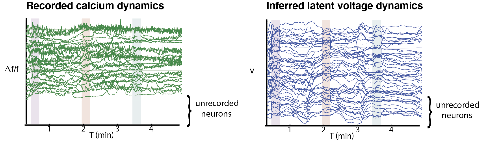

# wormvae

We provide offical PyTorch implementations for connectome-constrained latent variable model of whole-brain neural activity. 

The details of algorithm are presented in the paper [Connectome-constrained Latent Variable Model of Whole-brain Neural Activity](https://openreview.net/pdf?id=CJzi3dRlJE-), ICLR 2022. 

## Prerequisites
- Linux or macOS
- Python 3
- CPU or NVIDIA GPU + CUDA CuDNN

## Installation
- Clone this repo:
```bash
git clone https://github.com/TuragaLab/wormvae.git
cd wormvae
```
- Install dependencies by using `conda env create -f environment.yml`.

## Datasets Visualization

### Worm Connectivity
- Data folder `data/worm_connectivity` provides the connectome from C.elegans from the paper [The Structure of the Nervous System of the Nematode Caenorhabditis elegans (The Mind of a Worm)](https://www.wormatlas.org/MoW_built0.92/MoW.html).
- C.elegan Connectome.
  <div align="center">
  
  </div>

### Worm Activity
- Data folder `data/worm_activity` provides the measured fluorescence trace from C.elegans given chemosensory stimulus from the paper [NeuroPAL: A Multicolor Atlas for Whole-Brain Neuronal Identification in C. elegans](https://www.sciencedirect.com/science/article/pii/S0092867420316822).
- NeuroPAL Calcium Imaging of C.elegans.
  <div align="center">
  
  </div>

## Scripts Usage

### Model Training
Call the following script in `experiment/` to train a latent variable model for whole-brain neural activity.
```bash
python main.py --neuron_holdout list_of_neuron_holdout --train_worm list_of_worm_id --model_type model_type --constraint constraint --random_init_index random_init_index 
```
- `--neuron_holdout` defines the set of neurons to be held out during training. You can specify a list of neuron names to choose which neurons (typically a pair of symmetric neurons) to be held out, e.g. `--neuron_holdout ['BAGL','BAGR']`.
- `--train_worm` defines the set of worms to be trained. You can specify a list of worm ids to choose which worms to be trained on, e.g. `--train_worm [1]`.
- `--model_type` defines the types of synapse modeling. You can use `--model_type conductance` to specify a conductance-based modeling, while `--model_type current` to specify a current-based modeling.
- `--constraint` defines the constraint to synapse weight. `--constraint weight` indicates using connectome synapse count to constrain the weight; `--constraint sparsity` indicates using connectome synapse sparsity (binarized matrix) to constrain the sparsity, while the magnitude is still trainable; `--constraint unconstrained` indicates without connectome constrained, the weight is fully-connected matrix and the magnitude is trainable.
- `--random_init_index` defines the index of random initialization in each training trial. In the paper, we use 4 different random initializations to evaluate the models, e.g. `--random_init_index 0`.

## Outputs
Checkpints are saved as `experiment/chechpoints/task_name.pt` files , the training logging are saved as `experiment/logs/task_name.log` file; and the training loss trajectory are saved in the `experiment/loss_trajectories/task_name.pickle`. `task_name` is automatically defined with the options of arguments (neuron holdout, train worm, model types, constraint, etc.) described above.

### Sample Results
- Neuron holdout for neuron BAGL under different type of synapse model types and levels of connectome constraints.
  <div align="center">
  
  </div>
- Measured fluorescence traces (including unrecorded neurons) and inferred voltage for whole-brain (300 neurons).
  <div align="center">
  
  </div> 
  
